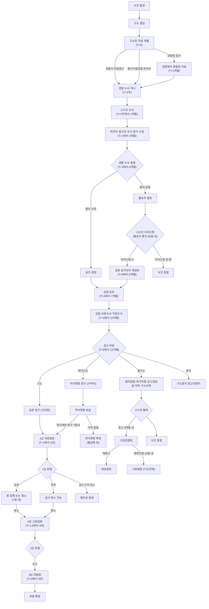

> 학습용 변환 자료. 한국 형사절차 표준 절차를 정리한 것.
> 근거: 형사소송법, 검찰청법, 경찰수사규칙(2021 검경수사권 조정 반영).

---

## 1) 큰 그림 — 시간순 한 줄

```
[사건 발생] → [고소 결심] → [고소장 제출] → [경찰 수사]
   → [경찰 결정: 송치 / 불송치]
       ├─ 송치   → [검찰 수사·보완] → [검찰 처분: 기소 / 불기소]
       │                                   ├─ 기소   → [법원 재판: 1심 → 2심 → 3심] → [유죄/무죄]
       │                                   └─ 불기소 → [고소인 불복: 항고 → 재항고 → 재정신청]
       └─ 불송치 → [고소인 불복: 이의신청] → 검찰로 사건 송치되어 재검토
```

---

## 2) 절차 그래프 (Mermaid)

> 각 노드의 **T+** 표기는 고소장 접수 시점을 T=0으로 한 **누적 경과 시간** (실무 평균).
> 사건 복잡도·법원 상황에 따라 ±50% 변동 가능.



### 📅 단계별 누적 경과 시간 한 줄 요약

| 시점 | 단계 |
|---|---|
| **T+0** | 고소장 접수 |
| **T+2주** | 경찰 1차 조사 시작 |
| **T+1개월** | 고소인 조사 완료 |
| **T+1~3개월** | 피의자·참고인 조사 |
| **T+3~6개월** | 경찰 수사 종결 (송치/불송치) |
| **T+4~7개월** | 검찰 송부 |
| **T+5~10개월** | 검찰 보완수사 |
| **T+6~12개월** | 검사 처분 (기소/불기소) |
| **T+1~2년** | 1심 판결 |
| **T+1.5~3년** | 2심 판결 |
| **T+2~4년** | 3심 (대법원) 확정 |

> 💡 형사 사건이 1심에서 끝나면 보통 **1~2년**. 3심까지 가면 **2~4년**.
> 💡 약식 사건(벌금형)은 **6개월~1년** 내 종결 다수.

---

## 3) 분기 핵심 — 송치 vs 불송치 vs 무죄

| 단계 | 이름 | 누가 정함 | 의미 | 고소인의 다음 카드 |
|---|---|---|---|---|
| 경찰 종결 | **송치** | 경찰 | 혐의 인정 → 검찰로 넘김 | 검찰 처분 기다리기 |
| 경찰 종결 | **불송치** | 경찰 | 혐의 없음 → 경찰 단계 종결 | **이의신청** (90일 내) |
| 검찰 종결 | **기소** | 검사 | 재판 청구 | (피의자가 다툼) |
| 검찰 종결 | **불기소** | 검사 | 재판 안 넘김 | **항고 → 재항고 / 재정신청** |
| 법원 종결 | **유죄** | 판사 | 죄 인정 | (피고인이 항소) |
| 법원 종결 | **무죄** | 판사 | 죄 인정 안 됨 | 검사가 항소 가능 |

---

## 4) 결정 단계별 "걸리는 시간" 감각

| 단계 | 통상 소요 |
|---|---|
| 고소장 접수 → 경찰 1차 조사 | 2주 ~ 2개월 |
| 경찰 수사 전체 | 3 ~ 6개월 (사건 복잡도에 따라 1년 이상도) |
| 송치 후 검찰 처분 | 1 ~ 6개월 |
| 1심 재판 | 6개월 ~ 1년 |
| 2심 | 4 ~ 8개월 |
| 3심 | 4개월 ~ 1년 |

> 실무 감각이지 법정 기한은 아닙니다. 형사소송법상 수사기관 처리기한은 강행규정이 적고, 지연돼도 그것만으로 사건이 무효가 되지 않습니다.

---

## 5) 가장 흔한 오해

- "고소장만 내면 알아서 처리해준다" → ✗. 고소인이 **증거를 정리해서 제출**해야 수사관이 움직입니다.
- "송치되면 처벌 확정이다" → ✗. 송치는 검찰이 다시 판단하는 시작점일 뿐.
- "불송치는 끝이다" → ✗. **90일 내 이의신청**으로 검찰 송치 가능.
- "무혐의 = 무죄" → ✗. 무혐의(혐의없음, 검찰 처분)와 무죄(법원 판결)는 다른 단계.